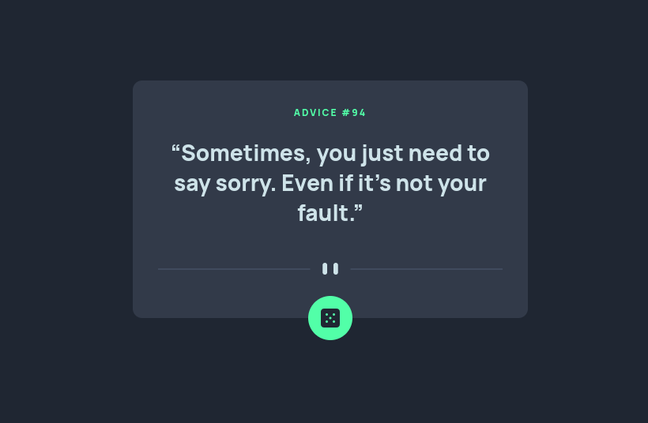

# Frontend Mentor - Advice generator app solution

This is a solution to the [Advice generator app challenge on Frontend Mentor](https://www.frontendmentor.io/challenges/advice-generator-app-QdUG-13db). Frontend Mentor challenges help you improve your coding skills by building realistic projects.

## Table of contents

- [Overview](#overview)
  - [The challenge](#the-challenge)
  - [Screenshot](#screenshot)
  - [Links](#links)
- [My process](#my-process)
  - [Built with](#built-with)
  - [What I learned](#what-i-learned)
  - [Continued development](#continued-development)
- [Author](#author)

## Overview

### The challenge

Users should be able to:

- View the optimal layout for the app depending on their device's screen size
- See hover states for all interactive elements on the page
- Generate a new piece of advice by clicking the dice icon

### Screenshot

### Links

- Live Site URL: [Live page](https://rwxganta.github.io/advice-generator-app/)

## My process

### Built with

- Semantic HTML5 markup
- CSS custom properties
- CSS pseudo-elements
- Flexbox

### What I learned

- I thing this is the first time I use the `<picture>` element while trying to set those seperator svg's, really awesome.

- I was getting really frustrated by the API request been the same after hitting the dice button and I start to think about the browser cache. Ended-up finding something called 'Cache busting', some kinda of unique id to the URL, so when we do the request the browser think it's a brand new one. *So, cache busting is like giving each request a new and different name, which ensures that you always get the freshest data from the server and avoids using outdated cached information.*

### Continued development

- In this project I was using XMLHttpResquest() function. I should be confortable on using the Fetch API for the next projects.

## Author

- Website - [In progress...]()
- Frontend Mentor - [@rwxganta](https://www.frontendmentor.io/profile/rwxganta)
- Twitter - [@rwxganta](https://www.twitter.com/rwxganta)
